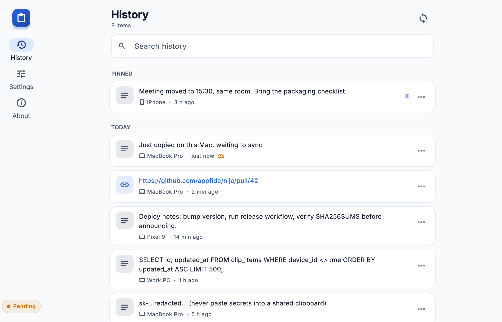
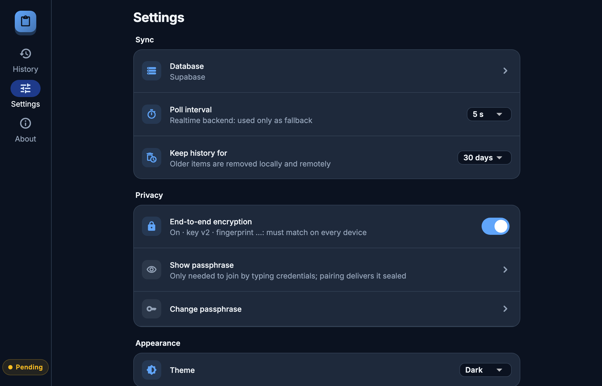
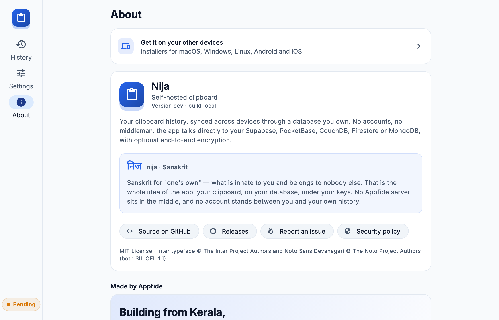
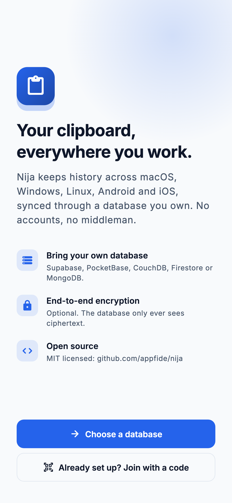
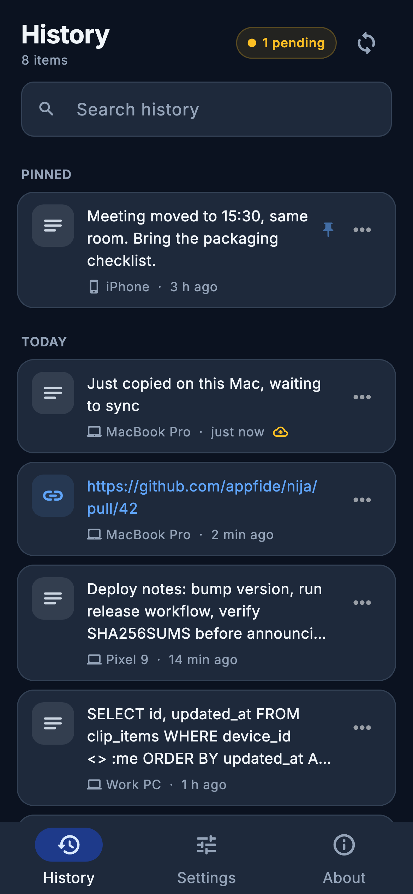
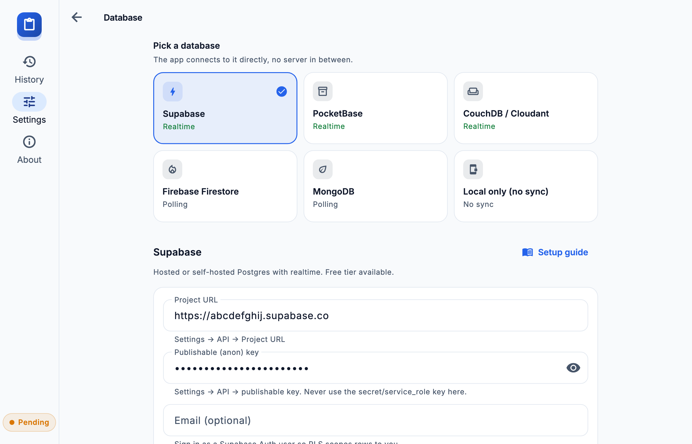
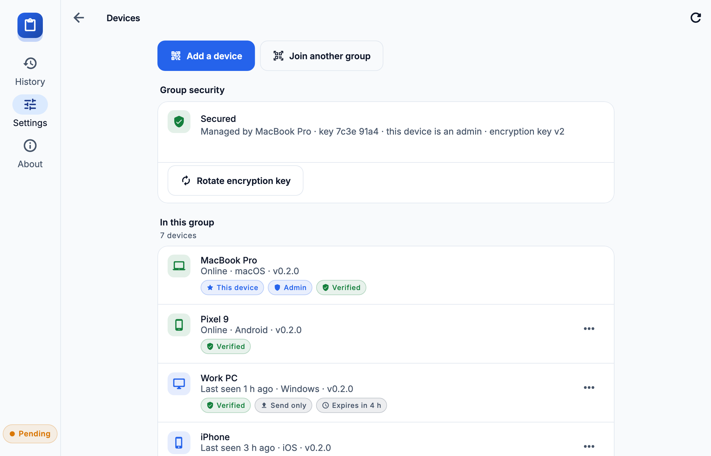
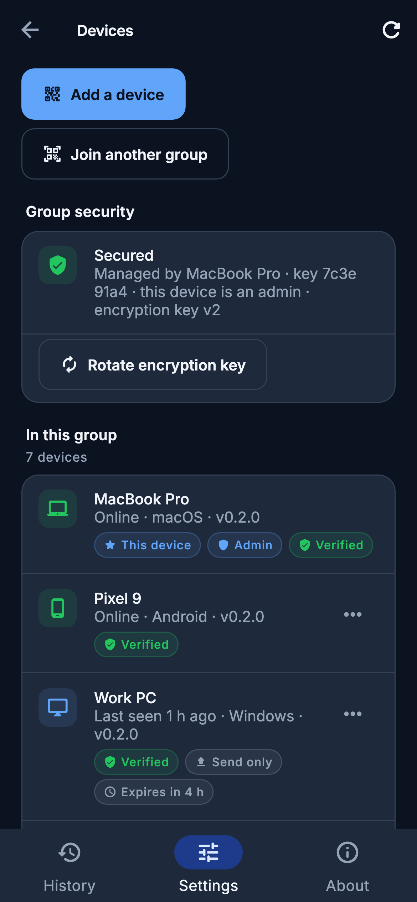
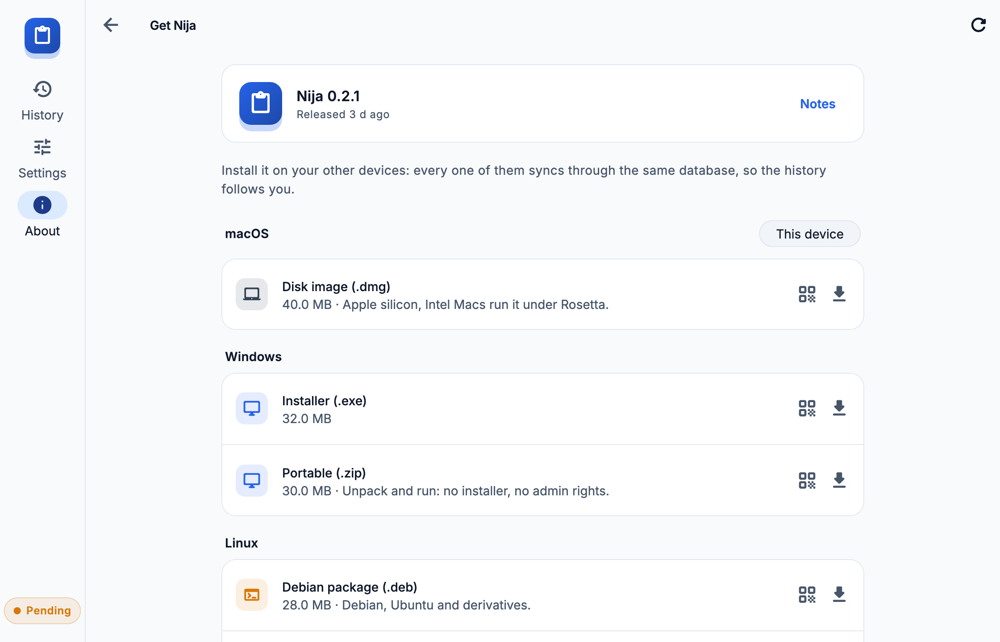

# Nija — Self-hosted Clipboard

[](https://github.com/appfide/nija/actions/workflows/ci.yml)
[](https://github.com/appfide/nija/releases)
[](LICENSE)

> **निज** *(nija)* is Sanskrit for **"one's own"** — what is innate to you and belongs to nobody else.
> That is the whole product: your clipboard, on your database, under your keys.

Clipboard history that syncs across **macOS, Windows, Linux, Android and iOS** through a database **you** provide. There is no Appfide server in the loop: the app talks directly to your Supabase, PocketBase, CouchDB, Firestore or MongoDB with the credentials you enter in Settings.

- **Bring your own database**: each backend has its own schema and settings form; setup guides in [`docs/backends/`](docs/backends).
- **End-to-end encryption** (optional): Argon2id-derived AES-256-GCM; the database only ever sees ciphertext.
- **Desktop-native**: runs in the tray, global hotkey, start at login.
- **Devices**: pair a new device with a PIN-protected QR code, give it a role (send-only / receive-only), temporary access, block or remove it, or send a clip to one device only. See [`docs/devices.md`](docs/devices.md).
- **Privacy filters**: honours password-manager "do not record" hints, can skip anything that looks like a key or token, and capture can be paused from the tray.
- **Get it on the next device**: *About → Get it on your other devices* lists the current release's installer for macOS, Windows, Linux, Android and iOS, with a QR code per link so a phone can scan it straight off the desktop screen.
- **Local-only mode**: works as a plain clipboard manager with no database at all.
- **Enterprise repo hygiene**: secret scanning on every commit and in CI, SHA-pinned Actions, reproducible release builds with checksums.

## Screenshots

| History (desktop) | Settings (dark) | About |
|---|---|---|
|  |  |  |

| Onboarding (phone) | History (phone, dark) | Database picker |
|---|---|---|
|  |  |  |

| Devices (desktop) | Devices (phone, dark) | Downloads |
|---|---|---|
|  |  |  |

## Install

Download the latest installer from [Releases](https://github.com/appfide/nija/releases): `.dmg`, `.exe`, `.deb` / `.AppImage`, `.apk`, unsigned `.ipa`. Builds are currently unsigned; see [docs/release.md](docs/release.md#installing-unsigned-builds).

## Set up a database

Pick one and follow its guide:

| Backend | Realtime | Guide |
|---|---|---|
| Supabase | ✅ | [docs/backends/supabase.md](docs/backends/supabase.md) |
| PocketBase | ✅ | [docs/backends/pocketbase.md](docs/backends/pocketbase.md) |
| CouchDB / Cloudant | ✅ | [docs/backends/couchdb.md](docs/backends/couchdb.md) |
| Firebase Firestore | polling | [docs/backends/firestore.md](docs/backends/firestore.md) |
| MongoDB | polling | [docs/backends/mongodb.md](docs/backends/mongodb.md) |

Then open the app → *Settings → Database*, paste the values, **Test connection & schema**, save. Enable *End-to-end encryption* with the same passphrase on every device.

## Platform notes

| | Capture | Notes |
|---|---|---|
| macOS / Windows / Linux | Automatic, in background | Tray icon, `⌘⇧V` / `Ctrl+Shift+V` opens history. Linux runs under XWayland by default (native Wayland restricts clipboard access). |
| Android | When the app is open | Android 10+ blocks background clipboard access. Copy, then open the app or tap *Capture*. |
| iOS | When the app is open | iOS asks "Allow Paste?" unless you set *Settings → Nija → Paste from Other Apps → Allow*. No background capture is possible. |

Details, prompts and data-protection notes: [docs/platforms.md](docs/platforms.md). Settings → *Permissions* has a live clipboard-access test.

## The name

**निज** (*nija*) is Sanskrit for "one's own" — that which is innate, personal, not borrowed from anyone.

The name is the architecture. Every other clipboard sync app puts a company between you and your own text: their server, their account, their retention policy, their breach. Nija has no server to breach. You point the app at a database you already control — a Supabase project, a PocketBase binary on a home server, a CouchDB instance, Firestore, MongoDB — and the devices talk to it directly. Turn on end-to-end encryption and even that database only ever holds ciphertext it cannot read.

Nothing of yours passes through Appfide. There is nothing to sign up for, nothing to cancel, and nothing for us to lose.

## Development

```sh
git clone https://github.com/appfide/nija.git && cd nija
./scripts/bootstrap.sh                      # pre-commit hooks, deps
cd packages/nija_core && dart test          # core: models, crypto, sync engine, adapters
cd ../../apps/nija && flutter run -d macos
```

See [CONTRIBUTING.md](CONTRIBUTING.md), [docs/architecture.md](docs/architecture.md) and [SECURITY.md](SECURITY.md).

## License

MIT © Appfide
